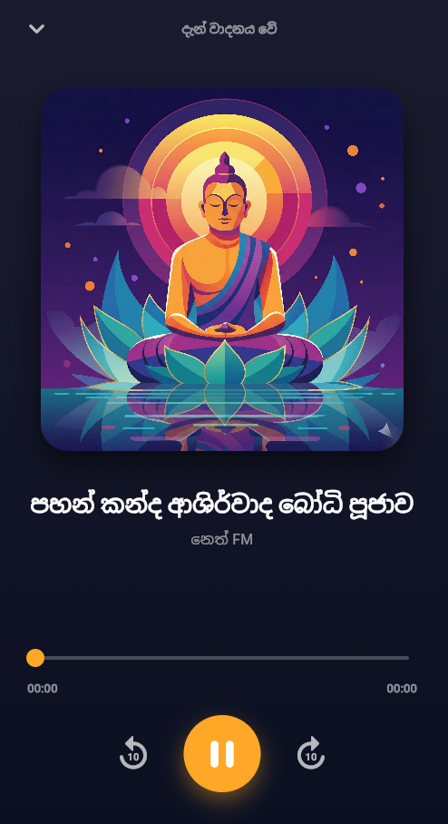
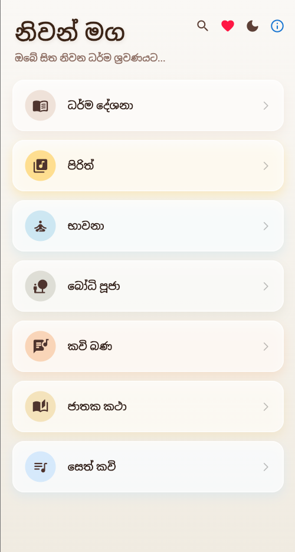
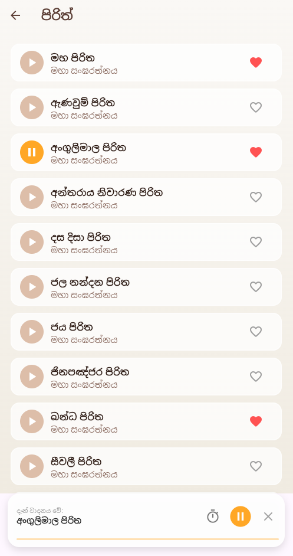
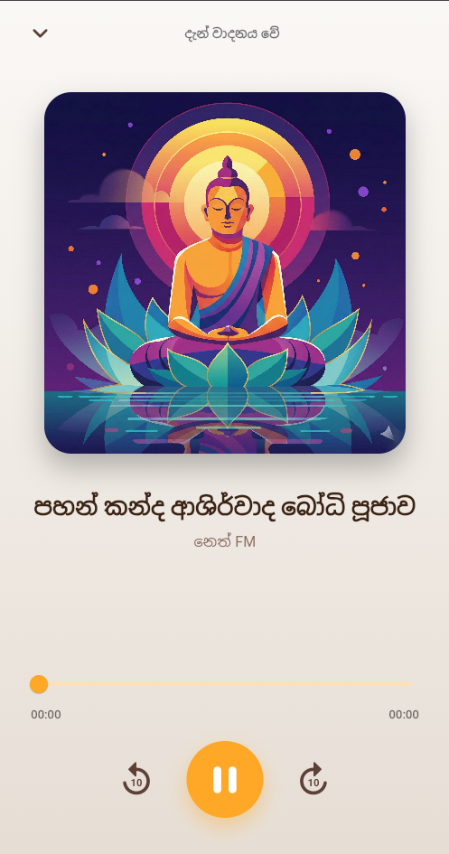

# ☸️ Niwan Maga (නිවන් මග) - Flutter Audio Streaming App

A serene and beautifully designed Flutter application for streaming Buddhist Dhamma sermons (Bana), Pirith, and Meditation audio. Built with a focus on performance, smooth user experience, and modern UI design.


---

## ✨ Key Features

* **☁️ Online Audio Streaming:** Play high-quality audio tracks directly from URLs without bloating the app size.
* **🎧 Background Playback:** Continue listening to Dhamma sermons even when the app is minimized or the screen is turned off (Powered by `just_audio_background`).
* **🌗 Dark/Light Mode:** Seamless theme switching with beautiful Material 3 aesthetics tailored for reading and listening comfort.
* **❤️ Favorites System:** Easily save and manage your most-listened tracks.
* **🚀 Smooth Animations:** Features a custom-animated splash screen and seamless page transitions.
* **📱 Responsive UI:** Perfectly adapts to different screen sizes and orientations.

---

## 🛠️ Tech Stack & Packages

This project utilizes the following core packages to deliver a seamless experience:
* `provider` - State management
* `just_audio` - Core audio playback engine
* `just_audio_background` - Background audio service
* `cupertino_icons` - iOS style icons
* `dio` & `url_launcher` - Network requests and external link handling

---

## 📸 Screenshots

| Splash Screen | Home Screen | Playlist Screen | Player Screen | Dark Mode |
| :---: | :---: | :---: | :---: | :---: |
|  |  |  |  |  |

---

## 🚀 Getting Started

Follow these steps to run the project on your local machine.

### Prerequisites
* Flutter SDK (v3.11.0 or higher)
* Android Studio / VS Code
* An Android/iOS device or Emulator

### Installation

1. **Clone the repository:**
   ```bash
   git clone [https://github.com/charithwannisingha/flutter-niwan-maga.git](https://github.com/charithwannisingha/flutter-niwan-maga.git)
   
2. Navigate to the project directory:
     cd flutter-niwan-maga
     
3. Install dependencies:
     flutter pub get

4. Run the app:
     flutter run

👨‍💻 Developed By
   Charith Wannisingha

* Passionate Flutter Developer

* Connect with me on GitHub

May the Triple Gem bless you! (තෙරුවන් සරණයි!) 🙏
